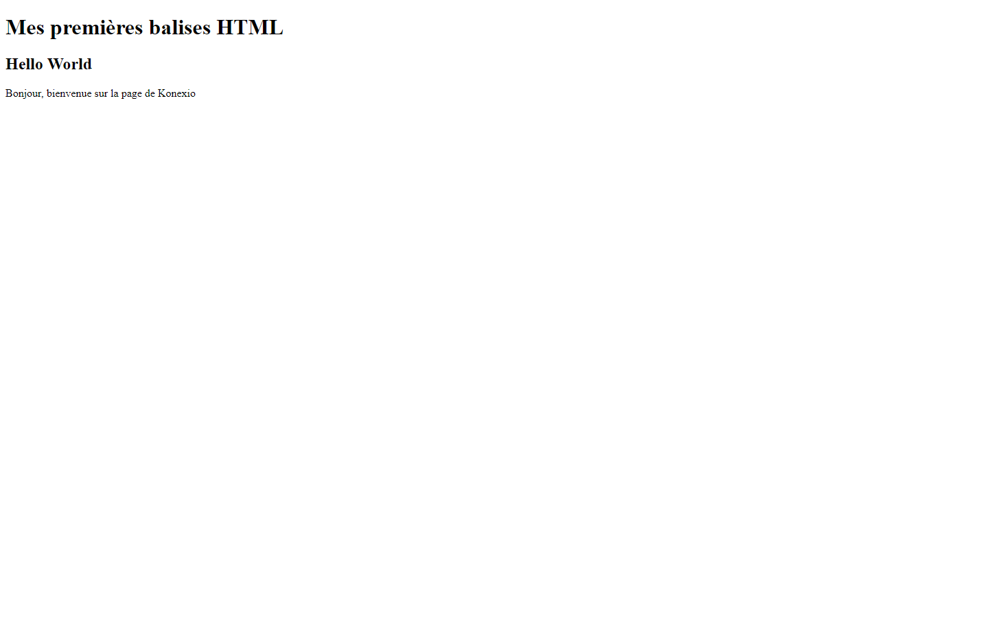

# Session 1 : Les premières balises HTML

## Cours

[Cliquer ici pour consulter le cours](https://docs.google.com/presentation/d/1OokHLME6Eg71ML5kG6fZDOzZW19I66jrDhp53HhurDs/edit?usp=sharing)

## Fichiers à modifier pour l'exercice

- `index.html`

## Instructions

- Ouvrir le fichier `index.html`
- Repérer les instructions de l'exercice dans les commentaires `<!-- TODO: Écrire [...] -->`
- Les instructions commencent toujours par `TODO:`
- À chaque instruction, écrire le code demandé sur une nouvelle ligne en dessous du commentaire.

Exemple :

```html
<!-- TODO: Écrire une balise <p> avec le contenu suivant : Hello World -->
<p>Hello World</p>
```

## Résultat attendu


