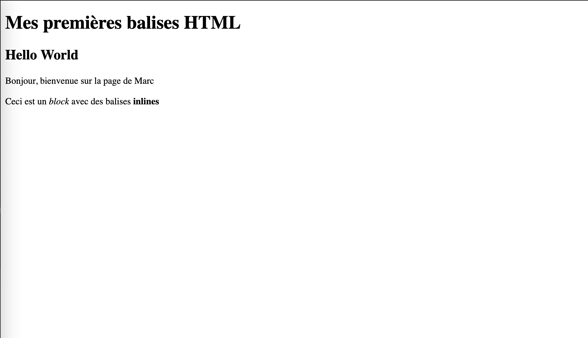

# Session 2 : Les attributs et les relations entre éléments HTML

## Cours

[Cliquer ici pour consulter le cours](https://docs.google.com/presentation/d/1OinkBalgUzUqBBnfSwUyvVWwmhcpKQxugBMiGdXfH-s/edit?usp=sharing)

## Fichiers à modifier pour l'exercice

- `index.html`

## Instructions

- Ouvrir le fichier `index.html`
- Repérer les instructions de l'exercice dans les commentaires `<!-- TODO: [...] -->`
- Les instructions commencent toujours par `TODO:`
- À chaque instruction, écrire le code demandé sur une nouvelle ligne en dessous du commentaire, sauf si on vous demande de modifier un élément existant

Exemple :

D'abord

```html
<!-- TODO: Écrire une balise <p> avec le contenu suivant : Hello World -->
<p>Hello World</p>

<!-- TODO: Modifier l'élément p ci-dessus pour souligner le mot World -->
```

Ensuite

```html
<!-- TODO: Écrire une balise <p> avec le contenu suivant : Hello World -->
<p>Hello <u>World</u></p>

<!-- TODO: Modifier l'élément p ci-dessus pour souligner le mot World -->
```

## Résultat attendu


