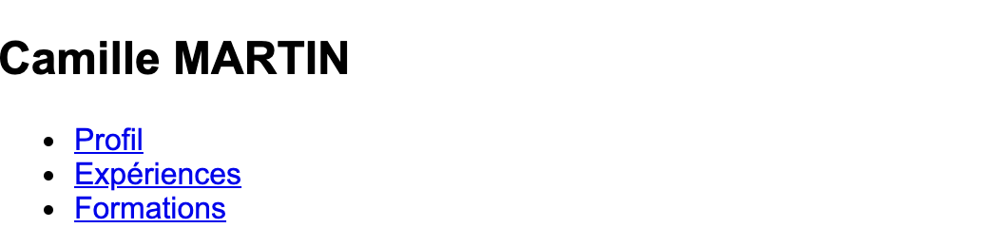

# Sessions 5 à 8 : Écrire un CV en HTML et CSS pour le publier en ligne

## Attention

**Il faut suivre les instructions telles quelles. Une fois le CV fini, vous pourrez changer le CV avec votre texte et votre photo.**

## Étape 1 - Structure HTML de base

**But de l'étape :** Construire une base valide pour votre document HTML.

- Créer un fichier `index.html` s'il n'existe pas.
- Écrire le doctype pour un fichier HTML5 sur la première ligne : `<!DOCTYPE html>`.
- Sur la ligne suivante, écrire la balise `<html>`.
- À l'intérieur de l'élément `<html>` :
  - Écrire la balise `<head>`.
  - Écrire la balise `<body>` en dessous avec le texte `Bonjour` à l'intérieur.

### Vérification - Étape 1

Avant de passer à l'étape suivante, allez sur le navigateur et vérifiez que le texte `Bonjour` s'affiche.
Si non, appelez un assistant ou regardez la solution pour vous aider.

<details>
    <summary>👀 Solution</summary>

```html
<!DOCTYPE html>
<html>
  <head> </head>
  <body>
    Bonjour
  </body>
</html>
```

</details>

## Étape 2 - Métadonnées

**But de l'étape :** Donner un titre à votre document et indiquer au navigateur quel [encodage](https://developer.mozilla.org/fr/docs/Glossaire/codage_caracteres) utiliser pour votre texte.

Dans l'élément `<head>` :

- Écrire une balise auto-fermante `<meta>` avec l'attribut `charset` et la valeur `utf8`.
- Écrire une balise `<title>` avec le texte `CV de Camille`.

### Vérification - Étape 2

Avant de passer à l'étape suivante, allez sur le navigateur, rechargez la page et regardez si l'onglet a le titre `CV de Camille`.

<details>
    <summary>👀 Solution</summary>

```html
<head>
  <meta charset="utf8" />
  <title>CV de Camille</title>
</head>
```

</details>

## Étape 3 - Structure CSS

**But de l'étape :** Ajouter une feuille de style à votre document.

- Créer le fichier `style.css` à côté du fichier `index.html` s'il n'existe pas.
- Dans `style.css`, écrire les règles suivantes pour l'élément `<body>` :
  - Appliquer la police de caractères `Arial` avec la propriété `font-family`.
  - Réduire les marges extérieures à `0` avec la propriété `margin`.
- Dans `index.html` :
  - Dans la balise `<head>`, écrire une balise `<link>` pour lier le fichier CSS créé à l'instant.

### Vérification - Étape 3

Avant de passer à l'étape suivante, vérifiez que le texte `Bonjour` a changé de police. Si non, appelez un assistant ou regardez la solution pour vous aider.

<details>
    <summary>👀 Solution</summary>

Dans `style.css` :

```css
body {
  font-family: Arial;
  margin: 0;
}
```

Dans `index.html` :

```html
<head>
  <link rel="stylesheet" href="style.css" />
</head>
```

</details>

## Étape 4 - Liens de navigation interne

**But de l'étape :** Créer des ancres qui permettront aux visiteurs de se déplacer instantanément vers les sections de leur choix.

Dans le fichier `index.html`, à l'intérieur de l'élément `<body>` :

- Effacer le texte `Bonjour`.
- Écrire une balise `<nav>` avec la classe `secondary-block`.
- À l'intérieur du `<nav>`, écrire une balise `<h2>` avec le texte `Camille MARTIN`.
- Sous le titre `<h2>`, écrire une liste `<ul>` contenant 3 items `<li>`.
- Dans chacun de ces 3 items `<li>`, écrire une balise `<a>`.
  1. Ajouter au premier élément `<a>` un attribut `href` avec la valeur `#profile` et le texte `Profil`
  2. Ajouter au second élément `<a>` un attribut `href` avec la valeur `#xp` et le texte `Expériences`.
  3. Ajouter au troisième élément `<a>` un attribut `href` avec la valeur `#education` et le texte `Formations`.

### Vérification - Étape 4

Avant de passer à l'étape suivante, vérifiez que le texte `Camille MARTIN` apparaît en gras et les textes `Profil`, `Expériences` et `Formations` ont des puces sur leur gauche. Si non, appelez un assistant ou regardez la solution pour vous aider.



<details>
    <summary>👀 Solution</summary>

```html
<nav class="secondary-block">
  <h2>Camille MARTIN</h2>
  <ul>
    <li><a href="#profil">Profil</a></li>
    <li><a href="#xp">Expériences</a></li>
    <li><a href="#education">Formations</a></li>
  </ul>
</nav>
```

</details>

## Étape 5 - Style des liens de navigation

**But de l'étape :** Changer le style de la section contenant les liens de navigation pour suivre le thème du CV.

Dans le fichier `style.css` :

- Écrire des règles pour l'élément `<nav>` qui lui donnent une hauteur de `70` pixels et changent son affichage (`display`) en conteneur flexible (valeur `flex`).
- Écrire des règles pour la classe `secondary-block` qui changent sa couleur de texte en blanc et change sa couleur de fond avec la valeur `rgb(4, 117, 186)`.
- Écrire une règle pour les éléments `<a>` qui change leur couleur en blanc.
- Écrire les règles suivantes pour l'élément `<h2>` enfant de `<nav>` :
  - Des marges extérieures `margin` à `0`.
  - Des marges intérieures `padding` :
    - `20` pixels en haut.
    - `0` à droite.
    - `20` pixels en bas.
    - `15` pixels à gauche.
- Écrire les règles suivantes pour l'élément `<ul>` enfant de `<nav>` :
  - Des marges extérieures `margin` à `0`.
  - Des marges intérieures `padding` à `24` pixels.
  - Supprimer les puces de la liste avec la propriété `list-style`.
- Écrire une règle pour les éléments `<li>` enfants de `<nav>` qui change leur marge extérieure gauche à `15` pixels.

### Vérification - Étape 5

Avant de passer à l'étape suivante, vérifiez que le fond est bleu, le texte est blanc et les liens sont alignés.
Si non, appelez un assistant ou regardez la solution pour vous aider.


<details>
    <summary>👀 Solution</summary>

```css
a {
  color: rgb(255, 255, 255);
}

.secondary-block {
  color: rgb(255, 255, 255);
  background-color: rgb(4, 117, 186);
}

nav {
  height: 70px;
  display: flex;
}

nav h2 {
  padding: 20px 0 20px 15px;
  margin: 0;
}

nav ul {
  margin: 0;
  list-style: none;
  padding: 24px;
}

nav li {
  margin-left: 15px;
}
```

</details>

# Etape 6 - En-tête HTML

Dans le fichier `index.html`

- Créer la balise `header` juste après la balise `</nav>`, à l'intérieur : - créer la balise `div` avec la classe `content` et à l'intérieur - créer la balise `h1` avec le texte _Camille MARTIN_ - créer la balise `h2` avec le texte _Développeuse fullstack_ - afficher l'image `camille_martin.png`

## Vérification

Avant de passer à l'étape suivante, vérifier que le prénom est en noire, le métier en bleu et l'image est ronde.
Si non, appeler un assistant et/ou regarder la solution pour vous aider.


<details>
    <summary>👀 Solution</summary>

```html
<header>
  <div class="content">
    <h1>Camille MARTIN</h1>
    <h2>Développeuse fullstack</h2>
    
  </div>
</header>
```

</details>

# Etape 7 - En-tête CSS

Dans le fichier `style.css`

- Créer le sélecteur de classe `content` - avec la propriété `max-width` de 800 pixels - avec la propriété `margin` de valeur `0 auto`

- Créer le sélecteur `header` - centrer tous les éléments inlines à l'intérieur - ajouter des marges intérieures de 40 pixels

- Créer le sélecteur qui ciblera la balise `h2` dans la balise `header` et qui change la couleur du texte en bleu (`#0475BA`)

- Créer le sélecteur qui ciblera unique les images dans la balise `header` - de 150 pixels de largeur - avec la propriété `border-radius` de 75 pixels - avec la propriété `box-shadow` de valeur `3px 3px 6px #AAA`

## Vérification

Avant de passer à l'étape suivante, vérifier que le prénom est en noire, le métier en bleu et l'image est ronde.
Si non, appeler un assistant et/ou regarder la solution pour vous aider.


<details>
    <summary>👀 Solution</summary>

```css
.content {
  max-width: 800px;
  margin: 0 auto;
}

header {
  text-align: center;
  padding: 40px;
}
header h2 {
  color: #0475ba;
}

header img {
  width: 150px;
  border-radius: 75px;
  box-shadow: 3px 3px 6px #aaa;
}
```

</details>

# Etape 8 - Présentation HTML

Dans le fichier `index.html`

- Créer une balise `section` à la suite de la balise `header` - avec l'ID `profile` (du même nom de l'ancre dans la navigation) - avec la classe `secondary-block` - à l'intérieur, créer une balise `div` avec la classe `content`. Et à l'intérieur de cette `div` - Créer la balise `h3` avec le texte `Présentation` - Créer une balise `ul` avec 3 `li` avec les textes de l'image suivante


## Vérification

Avant de passer à l'étape suivante, vérifier tous les textes de l'image apparaissent.
Si non, appeler un assistant et/ou regarder la solution pour vous aider.

<details>
    <summary>👀 Solution</summary>

```html
<section id="profile" class="secondary-block">
  <div class="content">
    <h3>Présentation</h3>
    <ul>
      <li>Passionée</li>
      <li>Autonome</li>
      <li>Une bonne journée ne se passe sans un bon livre</li>
    </ul>
  </div>
</section>
```

</details>

# Etape 9 - Présentation CSS

Dans le fichier `style.css`

- Créer le sélecteur `section` avec des marges intérieures de 40 pixels

C'est tout. Grâce au CSS déjà créer dans les sections précédentes, il n'y a rien d'autres à ajouter.

## Vérification

Avant de passer à l'étape suivante, vérifier que la page ressemble à l'image.
Si non, appeler un assistant et/ou regarder la solution pour vous aider.


<details>
    <summary>👀 Solution</summary>

```css
header {
  padding: 40px;
}
```

</details>

# Etape 10 - Expériences HTML partie 1

Dans le fichier `index.html`

- Créer une balise `section` d'ID `xp` (comme dans la navigation), à la suite de la première balise `section` - A l'intérieur de cette balise, créer une balise `div` de classe `content`

A l'intérieur de la div :

- Créer une balise `h3` avec le texte _Expériences professionnelles_
- Créer une balise `div`, et à l'intérieur - Créer une balise `aside` avec le texte `2018` - Créer une balise `h4` avec le texte `Stagiaire` - Créer une balise `ul` avec 2 `li` et les textes de l'image suivante


## Vérification

Avant de passer à l'étape suivante, vérifier que la page ressemble à l'image.
Si non, appeler un assistant et/ou regarder la solution pour vous aider.

<details>
    <summary>👀 Solution</summary>

```html
<section id="xp">
  <div class="content">
    <h3>Expériences professionnelles</h3>
    <div>
      <aside>2018</aside>
      <h4>Stagiaire</h4>
      <ul>
        <li>Création de sites web</li>
        <li>Management de projet</li>
      </ul>
    </div>
  </div>
</section>
```

</details>

# Etape 11 - Expériences HTML partie 2

Toujours dans le fichier `index.html`

En faisant extrêmement attention à l'indentation, créer une `div` contenant les balises `aside`, `h4` et `ul` juste avant la balise de fermeture `div.content` et juste avant la balise `div` qui contient la première expérience.

Reprenez les textes de l'image.


## Vérification

Avant de passer à l'étape suivante, vérifier que la page ressemble à l'image.
Si non, appeler un assistant et/ou regarder la solution pour vous aider.

<details>
    <summary>👀 Solution</summary>

```html
<section id="xp">
  <div class="content">
    <h3>Expériences professionnelles</h3>
    <div>
      <aside>2018</aside>
      <h4>Stagiaire</h4>
      <ul>
        <li>Création de sites web</li>
        <li>Management de projet</li>
      </ul>
    </div>
    <div>
      <aside>2016-2018</aside>
      <h4>Bénévole</h4>
      <ul>
        <li>Création de sites web</li>
        <li>Management de projet</li>
      </ul>
    </div>
  </div>
</section>
```

</details>

# Etape 12 - Expériences CSS

Dans le fichier `style.css`

- Créer le sélecteur d'ID `xp` qui cible l'enfant `ul` - avec les marges intérieures et extérieures à zéro. - en supprimant les puces de listes

- Créer le sélecteur qui ne sélectionne que les balises `li` de la section d'ID `xp` - avec une marge extérieure en bas de 10 pixels

- Créer le sélecteur `aside` de la section d'ID `xp` - avec la propriété `float` de valeur `right`


## Vérification

Avant de passer à l'étape suivante, vérifier que la page ressemble à l'image.
Si non, appeler un assistant et/ou regarder la solution pour vous aider.

<details>
    <summary>👀 Solution</summary>

```css
#xp ul {
  list-style: none;
  padding: 0;
  margin: 0;
}
#xp li {
  margin-bottom: 10px;
}
#xp aside {
  float: right;
}
```

</details>

# Etape 13 - Formations HTML et CSS

La présentation entre la section _Expériences_ et _Formations_ est très similaire.

### HTML

Sans instructions précises et en suivant les bases que vous avez déjà utilisé, reproduire la structure HTML qui ressemblera à cette image.


### CSS

Sans instructions précises et en suivant les bases que vous avez déjà utilisé, reproduire les sélecteurs CSS qui mettront le style correspondant à cette image.


## Vérification

Avant de passer à l'étape suivante, vérifier que la page ressemble à l'image.
Si non, appeler un assistant et/ou regarder la solution pour vous aider.

<details>
    <summary>👀 Solution</summary>

```html
<section id="education" class="secondary-block">
  <div class="content">
    <h3>Formations</h3>
    <ul>
      <li>
        <aside>2018</aside>
        Licence
      </li>
      <li>
        <aside>2015</aside>
        Bac S
      </li>
    </ul>
  </div>
</section>
```

```css
#education ul {
  list-style: none;
  padding: 0;
  margin: 0;
}
#education li {
  margin-bottom: 10px;
}
#education aside {
  float: right;
}
```

</details>

# Etape 14 - Passions

Dans le fichier `index.html`

- Créer une `section` et une `div` de classe `content` à l'intérieur

A l'intérieur de la `div.content`, créer les balises suivantes :

- `h3` avec le texte _Passions_
- `p` avec le texte `Saut en parachute`
- `p` avec le texte `Bali`

Normalement, vous n'aurez pas besoin de CSS puisque le style en cascade s'applique à tous les éléments en cours.


## Vérification

Avant de passer à l'étape suivante, vérifier que la page ressemble à l'image.
Si non, appeler un assistant et/ou regarder la solution pour vous aider.

<details>
    <summary>👀 Solution</summary>

```html
<section>
  <div class="content">
    <h3>Passions</h3>
    <p>Saut en parachute</p>
    <p>Bali</p>
  </div>
</section>
```

</details>

# Etape 15 - Footer HTML

Dans le fichier `index.html`

- Créer une balise `footer` ce classe `secondary-block` à la suite de la balise `section` - A l'intérieur, créer une balise `div` de classe `content`

A l'intérieur de la balise `div.content`

- Créer une balise `div` de classe `links` qui contiendra - Une balise `ul` avec 2 `li` qui eux-même contiendront 2 ancres (balise `a`) avec les attributs `href` de valeurs `#`

Mettre les textes correspondants à l'image dans la colonne de gauche.

En faisant attention à l'indentation, reproduire cette structure pour les 2 autres liens.


## Vérification

Avant de passer à l'étape suivante, vérifier que la page ressemble à l'image.
Si non, appeler un assistant et/ou regarder la solution pour vous aider.

<details>
    <summary>👀 Solution</summary>

```html
<footer class="secondary-block">
  <div class="content">
    <div class="links">
      <ul>
        <li><a href="http://konexio.eu" target="_blank">Voyage</a></li>
        <li><a href="http://konexio.eu" target="_blank">Tech</a></li>
      </ul>
    </div>
    <div class="links">
      <ul>
        <li><a href="http://konexio.eu" target="_blank">LinkedIn</a></li>
        <li><a href="http://konexio.eu" target="_blank">Twitter</a></li>
      </ul>
    </div>
  </div>
</footer>
```

</details>

# Etape 16 - Footer CSS

Dans le fichier `style.css`

- Créer le sélecteur `footer` avec des marges intérieures de 40 pixels

- Créer le sélecteur qui ciblera que les balises `ul` dans le `footer` - avec les marges intérieures et extérieures à zéro - en supprimant les puces de listes

- Créer le sélecteur de classe `links - avec une marge extérieure en bas de 25 pixels - une largeur de 390 pixels - avec la propriété`display`de valeur`inline-block`


## Vérification

Avant de passer à l'étape suivante, vérifier que la page ressemble aux images en version mobile et desktop.
Si non, appeler un assistant et/ou regarder la solution pour vous aider.

<details>
    <summary>👀 Solution</summary>

```css
footer {
  padding: 40px;
}
footer ul {
  list-style: none;
  padding: 0;
  margin: 0;
}

footer .links {
  margin-bottom: 25px;
  display: inline-block;
  width: 390px;
}
```

</details>

# Etape 17 - Customiser

Changer le texte et les couleurs à votre goût pour personnaliser votre CV.

# Etape 18 - Publier sa page sur internet

Votre page est terminée, il est temps de la mettre en ligne.

- Aller sur le site [Github](https://github.com/)
  - Créer un compte si vous en avez pas, autrement connectez-vous à votre compte
  - Valider votre inscription avec le lien reçu dans votre boîte email
- Télécharger, installer et se connecter au [Github Desktop](https://desktop.github.com/)
- Revenir sur la page Github et cliquer sur le "+" en haut à droite et cliquer sur `New repository`
  - Dans le `Repository name`, écrire `<username>.github.io` où `username` sera votre nom de compte (le même qui est déjà apparant dans la partie `Owner`)
  - Pas de `description`,
  - Garder le repository `Public`,
  - Laisser la case `Initialize this repository with README` décoché
  - Cliquer sur `Create repository`
- Une fois créée, une nouvelle page s'affichera et cliquer sur le bouton à gauche `Set up in desktop` et l'application Github Desktop va s'ouvrir
  - Cliquer sur le lien `open this repository` dans la fenêtre centrale et une fenêtre de l'explorateur Windows s'ouvrira
  - Copier tout le projet dans ce dossier
- Revenir sur le Github Desktop, ajouter le texte `first commit` dans le champs `Summary` et cliquer `Commit to master`
  - Ensuite cliquer sur `Publish branch`
  - Visiter le site `username.github.io` et partager le lien avec vos ami.e.s!
